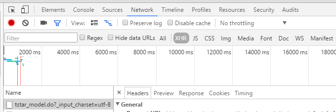
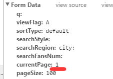

在上文我们提及过Ajax，这次我们来结合实例具体探讨一下，如何对使用了Ajax技术的网站进行抓取。
<!--more-->
## AJAX介绍

我们先来看一下官方的解释

> AJAX即“Asynchronous Javascript And XML”（异步JavaScript和XML），是指一种创建交互式网页应用的网页开发技术。
> AJAX = 异步 JavaScript和XML（标准通用标记语言的子集）。
> AJAX 是一种用于创建快速动态网页的技术。
> 通过在后台与服务器进行少量数据交换，AJAX 可以使网页实现异步更新。这意味着可以在不重新加载整个网页的情况下，对网页的某部分进行更新。
> 传统的网页（不使用 AJAX）如果需要更新内容，必须重载整个网页页面。

简而言之就是，在不刷新整个网站的基础之上，通过后台的少量数据交换，来对网站的部分内容进行刷新。

## AJAX的特点

举一个简单的例子，说明一下使用了AJAX技术和不使用AJAX技术的网站的区别。

- 打开百度贴吧，任意进入一个帖子`http://tieba.baidu.com/p/4695224909`，当我们点击`下一页`的时候，帖子进入了下一页，而它的网址也变成了`http://tieba.baidu.com/p/4695224909?pn=2`，网址改变了，说明跳转到了另一个网页，也就是网页整体刷新了一遍，这就是没有使用AJAX技术的网页。
- 我们在打开淘女郎的美人库官网`https://mm.taobao.com/search_tstar_model.htm?` ，可以看到，美人库里有许多页模特的信息，而当我们点击下一页的时候，会出现新的一页模特信息，但是，再看看网页的网址，还是`https://mm.taobao.com/search_tstar_model.htm?`，并没有改变，这说明，淘女郎官网使用了AJAX技术，我们切换下一页的时候， 并没有进入下一个网页，而只是在当前的网页上进行了局部的更新。

根据以上的区别，我们可以总结出，使用了AJAX技术的网页只交换少量数据，有利于增加网站访问的速度。
但是对于编写网络爬虫的人来说，抓取使用了AJAX技术的网页是很困难的，因为网页初始的HTML代码并没有包含网页的全部信息，往往我们需要抓取的内容并不包含在网页起始的源代码中（是动态刷新出来的）。以前，在浏览器看来，要展现的网站内容都是HTML页面文档，无论是静态网页还是服务器动态网页（例如，PHP、JSP、ASP等），下载到浏览器后都是HTML文档，搜索引擎或者网站内容抓取器的网络爬虫只需要处理文本内容即可（HTML文档是一个文本文档）。而在AJAX网站页面上除了有普通的HTML文档内容外，还有Javascript代码或者能够下载Javascript代码库的地址，在HTML文档加载过程中或者完成后调用Javascript函数或者代码段，这些代码段修改HTML文档的DOM结构，而DOM结构是HTML文档在浏览器窗口中显示的基础，通过这种方式动态地生成页面内容。这些内容可以是计算出来的，也可以是异步从服务器上获得那么。那么对于这类网站，我们应该如何抓取呢？

## 如何抓取应用了AJAX技术的网站

以目前来看，抓取这类网站，一般有两种办法：

- 利用 `selenium` 库来模拟浏览器的用户行为（如进入网站，切换下一页等），让服务器以为是真正的用户在浏览网页，从而获得完整的网页源代码（修改后的DOM文档结构）。
- 第二种是利用 *Chrome、Firefox* 等浏览器，对网站的网络数据交换进行监控，找到请求的后端服务url和传值的参数，然后构造数据包对该API进行POST，然后得到返回的数据（一般为JSON）即可。
  一般来讲，第一种方法会占用较大的系统资源，速度较慢，操作也不方便（原理简单，但是代码不好写）。所以我们一般使用第二种方法（代码量小，但是需要对大量的网络活动进行分析，找出数据交换的API）。

## 举例

### 需求

我们以抓取淘女郎的信息（姓名、工号、身高、体重、照片等）为例，演示如何对应用了AJAX技术的网站进行抓取。 淘女郎大概有410页信息，我们的目的是从第一页开始，将全部的信息抓取并保存到数据库中，这样的话，我们的目的是找出换页的API。

### 抓包

我们在chrome浏览器中打开淘女郎首页`https://mm.taobao.com/search_tstar_model.htm?` ，按F12打开开发者模式，切换到`Network`选项，按F5刷新，得到大量的网络活动，因为活动很多，不便于我们分析，所以我们切换到`XHR`选项来得到全部的AJAX活动，如下图。很幸运的是，该网站只有一个AJAX活动，我们不必从众多的活动中挑选了。

那么就极有可能这个URL为`https://mm.taobao.com/tstar/search/tstar_model.do?_input_charset=utf-8` 的活动就是换页的API，我们双击进入这个网址确认一下，看到网页的内容是一堆JSON数据，所以我们可以断定，这就是用来换页的API。

### 分析

然后我们再来分析一下这个API，看看我们需要POST怎样的数据包才能收到正确的换页信息。
这时，我们在网站中点击下一页，切换到下一页。再看右边的网络活动，又出现一个如上的活动。所以我们可以得出结论，第一个活动用来获取淘女郎第一页的数据，第二个活动用来获取淘女郎第二页的数据。我们对比两个活动的`FromData`。

可以发现在`currentPage`字段，第一页的值为1，第二页的值为2。所以我们可以断定。我们想获得哪一页的数据，构造数据包的时候就将 `currentPage` 的值设置为多少。于是我们可以构造如下数据包：
`tao_data = {"viewFlag":"A", "currentPage": pageNum}`
其中PageNum为页码。我们只要将这个数据包发给服务器，就可以得到对应页面的JSON（内含该页淘女郎的信息），然后我们将JSON解析一下，提取出有用的数据，存入到数据库中即可。

### 代码实现

在这里因为数据的结构比较灵活，使用传统的数据库不太方便，所以我们使用的是`MongoDB`数据库。
我们需要提前安装如下第三方库：

- `pip install requests`
- `pip install pymongo`

这是我的代码，大家可以参考一下：

```
from pymongo import MongoClient

import requests
import json

# 发送请求，得到JSON数据，将其加工并转化为Python的字典类型返回
def getInfo(pageNum):
    tao_data = {"viewFlag":"A", "currentPage": pageNum}
    try:
        r = requests.post("https://mm.taobao.com/tstar/search/tstar_model.do?_input_charset=utf-8", data = tao_data)
    except:
        return None
    raw_datas = json.loads(r.text)
    datas = raw_datas['data']['searchDOList']
    return datas

# 连接到MongoDB， 将信息保存
def main():
    client = MongoClient()
    db = client.TaoBao 
    col = db.TaoLady

    # 淘女郎一共有410页，所以我们抓取从1到第411页的内容。
    for pageNum in range(1, 411):
        print(pageNum)
        datas = getInfo(pageNum)
        if datas:
            col.insert_many(datas)


if __name__ == '__main__':
    main()

```

对于淘女郎的照片，我们只保存了图片的地址，并没有将照片下载到本地，如果想要将照片下载到本地，可以使用如下代码

```
from urllib.request import urlopen
from pymongo import MongoClient

# 抽取出照片的网址，下载，保存在pic文件夹中
def downPic():
    client = MongoClient()
    db = client.TaoBao 
    col = db.TaoLady
    for data in col.find():
        name = data['realName']
        url = "http:" + data['avatarUrl']
        pic = urlopen(url)
        with open("pic/" + name + ".jpg", "wb") as file:
            print(name)
            file.write(pic.read())


if __name__ == '__main__':
    downPic()

```

完整代码请[点击此处](https://github.com/WiseDoge/TaoBaoLady_Spider)

## 结语

在这里我们只举了一个很简单的例子来解释AJAX的抓取，事实上，在许多网站中，情况要复杂的多，但是再怎么复杂，只要仔细的分析网站代码和请求，就能将它抓取。